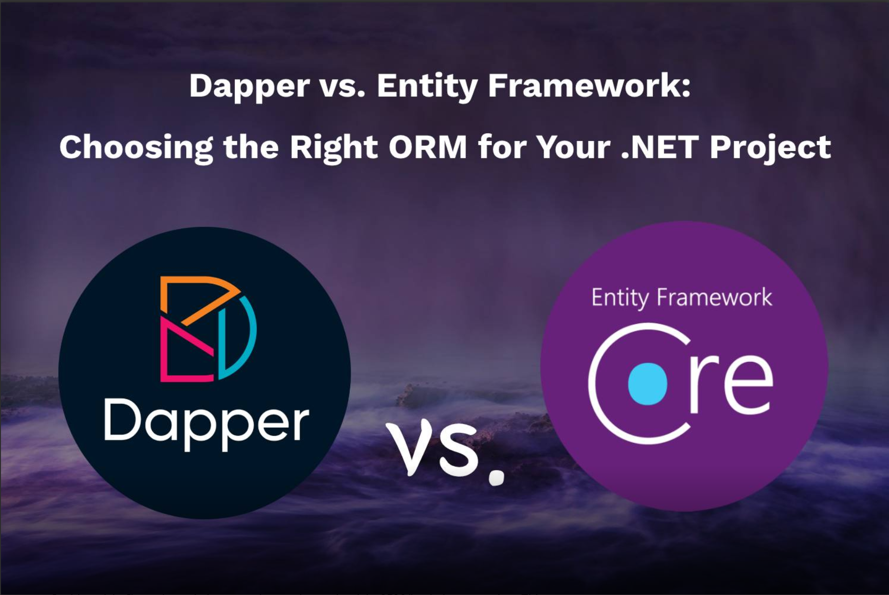

# Tìm hiểu ORM? Dapper ? 

## 1. ORM 

ORM (Object-Relational Mapping) là một kỹ thuật trong lập trình phần mềm cho phép chuyển đổi và ánh xạ giữa các đối tượng trong ngôn ngữ lập trình hướng đối tượng (như Java, C#, Python) với các bảng trong cơ sở dữ liệu quan hệ (như MySQL, PostgreSQL, SQL Server). 

  **Lợi ích của ORM**
  - **Tiết kiệm thời gian**
  - **Dễ bảo trì**
  - **Tương thích đa nền tảng**
  - **Bảo mật tốt hơn** : Giải nguy cơ lỗi SQL Injection 
  
  **Cách thức hoạt động**
  
  - **Ánh xạ đối tượng**: Một lớp(Class or Entity) trong mã nguốn sẽ được ánh xạ với một bảng trong DB 
  - **Tự động tạo câu lệnh SQL**: Khi bạn thực hiện các thao tác trên đối tượng, ORM sẽ tự động sinh ra các câu lệnh SQL tương ứng với cơ sở dữ liệu phía sau mà bạn không cần phải trực tiếp viết ra chúng. 
  
  **Cách tiếp cận**
  - **CodeFirst**: Tạo lớp đối tượng trước, sau đó ánh xạ nó
  - **DatabaseFirst**: Tạo bảng trong DB trước, sau đó ánh xạ nó

## 2. Dapper 

Dapper là một Micro ORM, (micro để phân biệt với các ORM được xây xây dựng bới các hãng lớn và có nhiều chức năng) được phát triển bới các developer của StackExchange  (nếu các bạn chưa rõ thì họ sở hữu Stack Overflow) dưới dạng phần mềm mã nguồn mở. 

  **Ưu điểm của Dapper** 

  - **Hiệu năng cao**: Dapper hoạt động rất nhanh vì nó không thêm quá nhiều lớp trừu tượng mà sử dụng trực tiếp các câu lệnh SQL. Nó tối ưu cho các ứng dụng có yêu cầu cao về hiệu suất. 
  - **Linh hoạt**: Bạn có thể kiểm soát hoàn toàn các truy vấn SQL của mình. Điều này rất hữu ích khi bạn cần tối ưu hóa truy vấn cho các tình huống cụ thể. 
  - **Đơn giản và dễ sử dụng**: Dapper có cú pháp đơn giản và dễ tích hợp vào bất kỳ dự án .NET nào. Bạn có thể dùng Dapper cùng với các công cụ ORM khác mà không xung đột.
  - **Tương thích tốt**: Dapper có thể làm việc với nhiều loại cơ sở dữ liệu khác nhau và hỗ trợ cả các truy vấn phức tạp, bảng ánh xạ kết hợp (join) và thủ tục lưu trữ (stored procedure).

  **Nhược điểm**
  - **KHông tự động hóa hoàn toàn**: Bạn phải tự viết các câu lệnh SQL cho các thao tác CRUD (Create, Read, Update, Delete). Điều này tốn thời gian hơn trong các dự án lớn.
  - **Không có nhiều tính năng nâng cao**: Không hỗ trợ đầy đủ các tính năng như theo dõi đối tượng (tracking), migrations (di chuyển dữ liệu), hoặc lazy loading (tải dữ liệu chậm) như Entity Framework. 

## 3. So sánh với Entity Framework. 

| Tiêu chí               | Dapper                               | Entity Framework                     |
|------------------------|--------------------------------------|--------------------------------------|
| **Hiệu năng**          | Cao                                  | Thấp hơn so với Dapper               |
| **Tính linh hoạt**     | Rất linh hoạt (viết SQL thủ công)    | Ít linh hoạt hơn (tự động hóa nhiều) |
| **Dễ sử dụng**         | Đơn giản, yêu cầu kiến thức SQL      | Dễ dàng với người không rành SQL     |
| **Quản lý truy vấn**   | Trực tiếp viết truy vấn SQL          | Tự động sinh SQL, có thể dùng Raw SQL|
| **Quy mô dự án**       | Nhỏ đến trung bình                   | Trung bình đến lớn                   |
| **Tính năng nâng cao** | Ít tính năng (chỉ tập trung CRUD)    | Nhiều tính năng ORM nâng cao         |

  