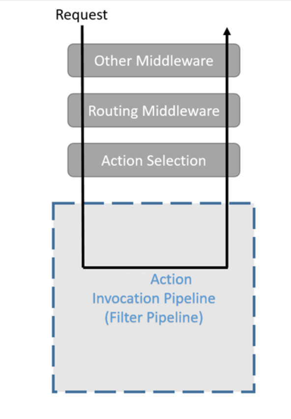
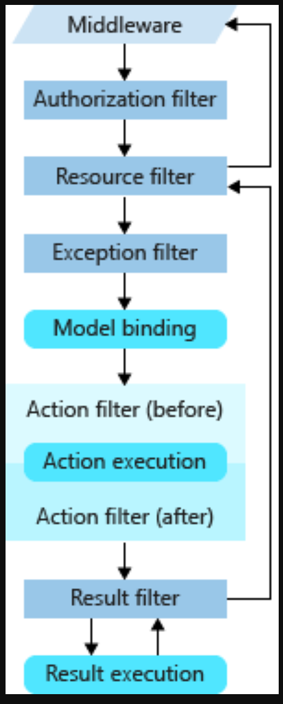

# Filters in ASP.NET Core
Filters trong ASP.net cho phép thực hiện code trước hoặc sau một trạng thái đặc biệt trong request processing pipeline.

Các filter có sẵn kiểm soát các tác vụ như:
- Authorization(phân quyền), preventing (ngăn ngừa) truy cập đến tài nguyên từ những người không có quyền truy cập
- Cathing response, short-circuiting the request pipeline để trả về catched response 

Custom filters có được cài đặt để kiểm soát cross-cutting concerns.
```bash
`Cross-cutting là một khái niệm trong lập trình và thiết kế phần mềm, đặc biệt trong ngữ cảnh phát triển ứng dụng và kiến trúc phần mềm. Nó thường liên quan đến các khía cạnh mà không thuộc về một module hay lớp cụ thể nào, nhưng lại cần phải được xử lý đồng nhất trong nhiều phần của ứng dụng. Ví dụ như: Logging(Ghi log), Error Handling (Xử lý lỗi), Security (Bảo mật), Transaction Management (Quản lý giao dịch)
```
Filter giúp tránh xa (avoid) dupplicate code. For example, an error handling exception filter could consolidate error handling.

## How filters work
Filters chạy trong một trong một ống dẫn request (pipeline) đến một action trong asp, thường được gọi là filter pipeline. 
Filters pipeline chạy sau khi asp.net chọn phương thức thực thi request
 


## Filter pipeline type
 

ASP.NET Core cung cấp nhiều loại filters để xử lý các tác vụ khác nhau:

- **Authorization filters**: Xác thực và phân quyền trước khi action method được gọi.
  - Ví dụ: `[Authorize]`
  
- **Resource filters**: Được gọi trước và sau khi routing hoàn thành nhưng trước khi model binding xảy ra. Những filters này có thể can thiệp vào quá trình thực thi action.
  
- **Action filters**: Được thực thi trước và sau action method của controller.
  - Ví dụ: `[ServiceFilter(typeof(MyActionFilter))]`

- **Exception filters**: Xử lý ngoại lệ phát sinh trong quá trình thực hiện action method.
  
- **Result filters**: Được gọi trước và sau khi kết quả (ví dụ: view) được trả về từ action method.

## 2. Cách Hoạt Động Của Filter Pipeline

Dòng xử lý của Filter Pipeline tuân theo trình tự:

- **Trước Action**: Các `Authorization filters` và `Resource filters` được thực thi.
- **Action Method**: Các `Action filters` được thực thi, sau đó action method của controller được gọi.
- **Sau Action**: `Result filters` và `Exception filters` sẽ xử lý kết quả sau khi action method hoàn thành.

## 3. Cách Sử Dụng Filters

### a. Sử dụng Filter Attribute có sẵn

Bạn có thể sử dụng các attributes có sẵn trên controller hoặc action method.

```csharp
[Authorize]
public IActionResult SecureAction()
{
    return View();
}
```

### b. Tạo Custom Filter

Bạn có thể tạo filters tùy chỉnh bằng cách kế thừa từ các interface của ASP.NET Core.

```csharp
public class MyActionFilter : IActionFilter
{
    public void OnActionExecuting(ActionExecutingContext context)
    {
        // Thực thi trước khi action method được gọi
        Console.WriteLine("Before executing action");
    }

    public void OnActionExecuted(ActionExecutedContext context)
    {
        // Thực thi sau khi action method hoàn tất
        Console.WriteLine("After executing action");
    }
}
```

Sau đó áp dụng filter này vào controller hoặc action method:

```csharp
[ServiceFilter(typeof(MyActionFilter))]
public IActionResult MyAction()
{
    return View();
}
```

### c. Đăng Ký Filter Toàn Cục

Bạn cũng có thể đăng ký filter áp dụng toàn cục cho toàn bộ ứng dụng:

```csharp
public void ConfigureServices(IServiceCollection services)
{
    services.AddControllersWithViews(options =>
    {
        options.Filters.Add(new MyActionFilter()); // Đăng ký filter toàn cục
    });
}
```

## 4. Short-Circuiting Trong Filter Pipeline

Short-circuiting xảy ra khi một filter có thể ngăn chặn phần còn lại của pipeline không được thực hiện. Ví dụ, trong trường hợp người dùng không đủ quyền, một `Authorization filter` có thể trả về `403 Forbidden` và dừng pipeline.

```csharp
public class MyAuthorizationFilter : IAuthorizationFilter
{
    public void OnAuthorization(AuthorizationFilterContext context)
    {
        if (!context.HttpContext.User.Identity.IsAuthenticated)
        {
            // Short-circuit pipeline nếu không xác thực
            context.Result = new UnauthorizedResult();
        }
    }
}
```

## 5. Kết Luận

- **Filter pipeline** là một công cụ mạnh mẽ để xử lý các yêu cầu HTTP trước và sau khi action method được thực thi.
- Filters có thể được áp dụng cho các tác vụ như logging, security, validation, và error handling.
- Bạn có thể sử dụng các filters có sẵn hoặc tạo filters tùy chỉnh theo nhu cầu.

Filter Pipeline giúp cho việc phát triển ứng dụng ASP.NET Core dễ dàng hơn khi xử lý các tác vụ cross-cutting và giúp mã nguồn dễ bảo trì hơn.
