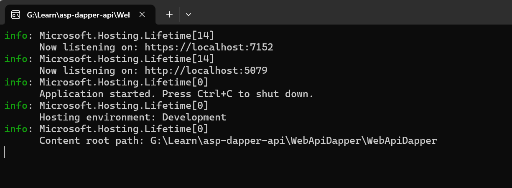
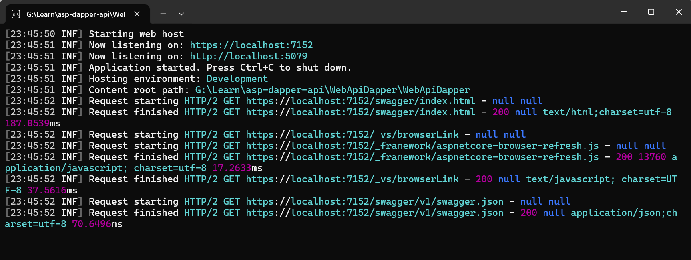

# Setting Up Serilog
Khi ta tạo một ứng dụng .net và khởi chạy với trình logging mặc định, hãy để ý sự khác biệt:

  

và logging sau khi dùng `Serilog`:

  

## 1. Configuring Additional Sinks 
### Seq 
Một công cụ tuyệt vời để xem cấu trúc log. Tự tìm hiểu thêm [Download](https://datalust.co/download)
```bash
Log.Logger = new LoggerConfiguration()
    .WriteTo.Console()
    .WriteTo.Seq("http://localhost:5341")
    .CreateLogger();
```
    image

### File
Một nơi lưu trữ hữu ích khác là `File`. 
Config
Install package File sink
`PM> Install-Package Serilog.Sinks.` 

Config in `program` file
```bash
Log.Logger = new LoggerConfiguration()
    .WriteTo.Console(new JsonFormatter())
    .WriteTo.Seq("http://localhost:5341")
    .WriteTo.File("log.txt")
    .CreateLogger();
```
Có thể thêm định dạng như trong `console` 
```bash 
Log.Logger = new LoggerConfiguration()
    .WriteTo.Console(new JsonFormatter())
    .WriteTo.Seq("http://localhost:5341")
    .WriteTo.File(new JsonFormatter(), "log.txt")
    .CreateLogger();
``` 
### SQL Server (DB)
Lưu log trong DB.
Install `package`

    PM> Install-Package Serilog.Sinks.MSSqlServer 
Config in `program` file
```bash
 Log.Logger = new LoggerConfiguration()
    .WriteTo.Console(new JsonFormatter())
    .WriteTo.Seq("http://localhost:5341")
    .WriteTo.File(new JsonFormatter(), "log.txt")
    .WriteTo.MSSqlServer("Data Source=localhost;Initial Catalog=LoggingDb;Integrated Security=SSPI",
                         new MSSqlServerSinkOptions
                         {
                             TableName = "Logs",
                             SchemaName = "dbo",
                             AutoCreateSqlTable = true
                         })
    .CreateLogger();
 ```

# Different Log Levels in Serilog 
Cấp đô Logger phân loại theo mức độ nghiêm trọng có sự kiện logger. Có 6 cấp độ:
|  Level | Mô tả  |
|--|--|
| Verbose |  Mức độ thấp nhất - Cho phép ghi log, chủ yếu khắc phục xự cố ứng dụng|
| Debug|  Dùng cho mục đích debug - Quan sát trong quá trình chạy ứng dụng trong môi trường dev|
| Information |  Dùng cho mục đích giám sát - theo dõi thông tin request hoặc response hay kết quả của operation|
| Warning|  Cảnh báo - Review cảnh báo kết quả (non-critical) & (non-friendly)|
| Error|  Hữu ích nhất - Cho phép theo dõi và ghi log các lỗi phát sinh|
| Fatal|  Quan trọng nhất - Cho phép ghi log những kết quả cần chú ý khẩn cấp|

# Best Practices for Logging With Serilog 
## 1.  Avoid the Static Logger Class 
Có thể sử dụng class tĩnh `Log` - là một class được build-in sẵn trong .net để log thông tin hoặc các event ra console hay file. 

```bash
Log.Logger = new LoggerConfiguration()
    .WriteTo.File(
        "logs/log.txt",
        retainedFileCountLimit: 7,
        rollingInterval: RollingInterval.Day)
    .MinimumLevel.Information()
    .CreateLogger();
try
{
    var builder = WebApplication.CreateBuilder(args);
    // code ommited for brevity
    app.Run();
}
catch (Exception ex)
{
    Log.Error(ex, "The exception was thrown during application startup");
}
finally
{
    Log.CloseAndFlush();
}
``` 
Trong đoạn code trên, tôi đã sử dụng thuộc tính `Logger`  của lớp `Log` để config thông tin khi ghi log. 

**Hạn chế:** 
 - **Phá vỡ nguyên tắc DI**, các lớp tĩnh không thể dễ dàng tiêm vào hoặc mock được, làm cho việc kiểm thử trở nên khó khăn. Không có DI, việc cung cấp các logger hoặc cấu hình khác nhau cho các môi trường khác nhau rất kho khăn.
 - **Trạng thái toàn cục và an toàn luồng**: Hiện nay các app chủ yếu chạy đa luồng, nên việc sử dùng static ở mức toàn cục sẽ rất dễ gây ra việc các logging có thể bị xen kẻ - không đồng nhất. 
 - **Cấu hình và tính linh hoạt**: Logger tĩnh hạn chế tính linh hoạt vì cấu hình của nó áp dụng cho toàn bộ ứng dụng. Ví dụ, nếu nhiều thành phần cần các định dạng hoặc mức logging khác nhau, một logger tĩnh duy nhất không thể đáp ứng được các sự khác biệt này một cách dễ dàng.
 - Và còn nhiều thứ khác như **Kiểm thử**, **tính đóng gói**,...

## 2. Configure From appsetting.json 
Có hai cách để config serilog là **Fluent API** và **appsetting.json**. Nhưng tôi khuyên bạn nên sử dụng **appsetting.json** để config. Vì khi dùng **Fluent API** mà có bất kỳ sự thay đổi nào ta phải publish bản build mới trong khi đó, ta chỉ cần chỉnh sửa cấu hình ở file **appsetting.json**
Đầu tiên, cài đặt package 

    Install-Package Serilog.Settings.Configuration
  
 Config in appsetting.json
 ```bash
"Serilog": {
  "Using": [
    "Serilog.Sinks.Console"
  ],
  "MinimumLevel": {
    "Default": "Information"
  },
  "WriteTo": [
    {
      "Name": "Console",
      "Args": {
        "OutputTemplate": "[{Timestamp:HH:mm:ss} {Level:u11}] {Message:lj}{NewLine}"
      }
    }
  ],
  "Properties": {
    "ApplicationName": "Weather API"
  }
}
``` 
Sau đó, dùng nó trong **programs**
```bash
builder.Host.UseSerilog((context, config) =>
    config.ReadFrom.Configuration(context.Configuration));
``` 
## 3. Always Use Structured Logging 
Nên sử dụng logging theo cấu trúc: 
Chúng ta không nên sử dụng dạng simple string khi loggin:
```bash
logger.LogInformation(
    $"The weather today will be {forecast[0].Summary} and {forecast[0].TemperatureC} degrees.");
```
Thay vào đó, hãy sử dụng:
```bash
logger.LogInformation(
    "The weather today will be {Summary} and {Temperature} degrees.",
    forecast[0].Summary,
    forecast[0].TemperatureC);
``` 
Điều này giúp dễ dàng phân tích và tìm kiếm hơn,...

## 4. Forget About Serilog’s Console and File Sinks in Production 
Thay vì sử dụng console và file sinks trong production, hãy chuyển log đến các dịch vụ tập trung hoặc sử dụng các **network sinks**:
-   **Elasticsearch**: Lưu trữ log tập trung và hỗ trợ tìm kiếm, phân tích mạnh mẽ.
-   **Azure Application Insights hoặc AWS CloudWatch**: Dịch vụ giám sát ứng dụng đám mây hỗ trợ logging và cảnh báo.
-   **Splunk hoặc DataDog**: Cung cấp khả năng giám sát, phân tích log và cảnh báo mạnh mẽ cho môi trường production. 

Sử dụng các công cụ này giúp giảm tải cho ứng dụng và cải thiện khả năng giám sát, phân tích và bảo mật log trong môi trường production. 

## 5. Use Built-in Event Log Enrichers
## 6. Create Custom Log Event Enricher for Serilog
## 7. Request Logging With Serilog